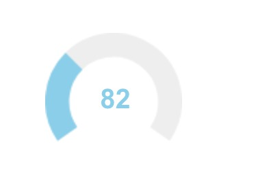

# vue-touch-knob
### 安装
  ```js
   npm i vue-touch-knob -S
  ```
### 使用
  ```js
  <template>
    <div>
      <vue-knob></vue-knob>
    </div>
  </template>

  <script>
  import vueKnob from 'vue-touch-knob'
  export default {
    name: 'App',
    components: {vueKnob}
  }
</script>
  ```
## 效果
 
## 传值 
 ```js
  props: {
    value: {
      type: Number,
      default: 10
    },
    min: {
      type: Number,
      default: 0
    },
    max: {
      type: Number,
      default: 255
    },
    step: {
      type: Number,
      default: 1
    },
    cursor: {
      type: Boolean,
      default: false
    },
    thickness: {
      type: Number,
      default: 0.35
    },
    lineCap: {
      type: String,
      default: 'butt'
    },
    readOnly: {
      type: Boolean,
      default: false
    },
    displayInput: {
      type: Boolean,
      default: true
    },
    width: {
      type: Number,
      default: 100
    },
    height: {
      type: Number,
      default: 100
    },
    bgColor: {
      type: String,
      default: '#EEEEEE'
    },
    fgColor: {
      type: String,
      default: '#87CEEB'
    },
    angleOffset: {
      type: Number,
      default: -125
    },
    angleArc: {
      type: Number,
      default: 250
    }
  }
 ```
